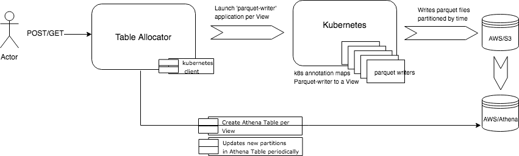

## Architecture




### Getting Started?
Launch the table-allocator dropwizard app that exposes endpoint for creating and listing the views. 
The allocator uses kubernetes for running parquet-writers by default. If you are using minikube, make sure it is running and current k8s context points to it.

##### Create a new view:

```
curl -XPOST -H "Content-Type: application/json" -d '
{
  "view": "oms",
  "select": [
    "tags[errorcode]",
     "operationname"
  ],
  "where": {
    "servicename": "oms"
  }
}' "http://localhost:8080/sql"
```


##### List all views:

```
curl "http://localhost:8080/sql"
```

##### Delete a view:

```
curl -XDELETE "http://localhost:8080/sql/oms"
```


